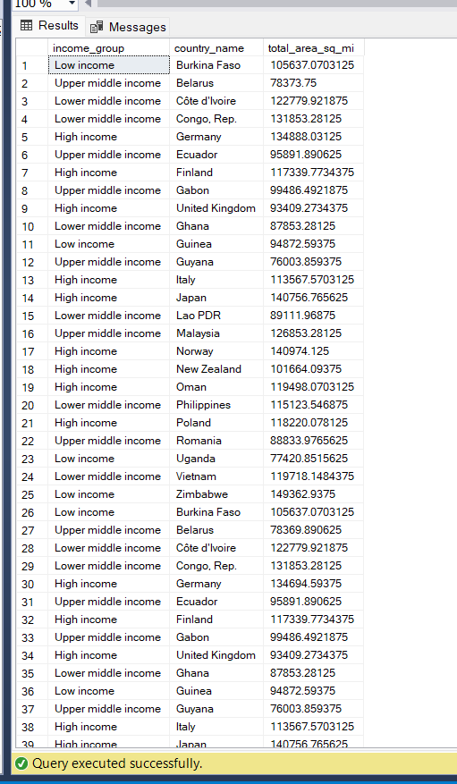

# Deforestation_data_with_SQL

Deforestation or forest clearance is the removal of a forest or stand of trees from land that is then converted to non-forest use. Deforestation can involve the conversion of forest land to farms, ranches, or urban use. The most concentrated deforestation occurs in tropical rainforests. About 31% of Earth's land surface is covered by forests at present. This is one-third less than the forest cover before the expansion of agriculture, with half of that loss occurring in the last century. Between 15 million to 18 million hectares of forest, an area the size of Bangladesh, are destroyed every year. On average 2,400 trees are cut down each minute.

## Data Cleaning 🧹

- The _land_area_ dataset is not clean. I moved it into power-query. Only the _total_area_sq_mi_ column has missing values. I replaced the missing values with the average for the values in that column. The average is **457096.3525**.
- The _forest_area_ dataset also has missing values in the _forest_area_sqkm_ column. I moved the data into power-query. I replaced the missing values in the _forest_area_sqkm_ column with the average. The average is **391051.8409**.
- The _regions_ dataset is clean.

I imported the clean data into _microsoft SQL server_ for analysis.

**REGIONS**

**LAND_AREA**

**FOREST_AREA**

## Questions to answer ❓❔
1. Find the total number of countries involved in deforestation.
2. Show the income groups of countries having total area ranging from 75,000 to 150,000.
3. Retrieve the names of countries that have a forest area (in square kilometers) greater than the average forest area of all countries in the "High Income" income group.
4. Calculate the average total area (in square miles) for countries in the "Upper Middle Income" income group. Compare the result with the rest of the income categories.
5. Determine the total forest area (in square kilometers) for countries in the "High Income" income group. Also, compare with the other income categories.
6. What are the countries from each region or continent having the highest total forest area?

## Analysis
1. Total number of countries involved in deforestation

`SELECT COUNT(DISTINCT(country_name)) AS no_of_countries_deforesting FROM regions;` 

There are **218** countries involved in deforestation.

  

  ---
  2. Income groups of countries having total area ranging from 75,000 to 150,000.

`SELECT DISTINCT(income_group) FROM regions R JOIN land_area L ON R.country_code = L.country_code
WHERE L.total_area_sq_mi >= 75000 AND L.total_area_sq_mi <=150000;`

---
3. Names of countries that have a forest area (in square kilometers) greater than the average forest area of all countries in the "High Income" income group.

`SELECT DISTINCT(country_name) FROM forest_area WHERE forest_area_sqkm >
(SELECT AVG(forest_area_sqkm) AS average_farea_high_income FROM forest_area F JOIN regions R ON F.country_code = R.country_code
WHERE income_group = 'High income');`

The subquery gives the value of the average forest area for all countries in the "High Income" group which is **392991974.880886sqkm**. This value is what is fed to the main query to give the list of countries.

---
4. Average total area (in square miles) for countries in the "Upper Middle Income" income group.

`SELECT AVG(total_area_sq_mi) AS avg_total_area_Upper_middle_income FROM land_area L JOIN regions R ON L.country_code = R.country_code
WHERE income_group = 'Upper middle income'`

`SELECT income_group, AVG(total_area_sq_mi) AS avg_total_area FROM land_area L JOIN regions R ON L.country_code = R.country_code
GROUP BY income_group
ORDER BY avg_total_area DESC;`

The "Upper middle income" group has the highest _average total area_ while the "low middle income" has the lowest.

---
5. Total forest area (in square kilometers) for countries in the "High Income" income group.

`SELECT SUM(forest_area_sqkm) AS total_forest_area FROM forest_area F JOIN regions R ON F.country_code = R.country_code
WHERE income_group = 'High income';`

`SELECT income_group, SUM(forest_area_sqkm) AS total_forest_area FROM forest_area F JOIN regions R ON F.country_code = R.country_code
GROUP BY income_group
ORDER BY total_forest_area DESC;`

The "High Income" group has the highest _total forest area_ while the "low Income" group has the lowest.

---
6. What are the countries from each region or continent having the highest total forest area?

I used Subquery and Windows functions to get the countries from each continent having the highest total forest area.

`SELECT DISTINCT(country_name), region, forest_area_sqkm FROM
(SELECT R.country_name, region, forest_area_sqkm, DENSE_RANK() OVER(PARTITION BY region ORDER BY forest_area_sqkm DESC) AS rank_order
FROM regions R JOIN forest_area F ON R.country_name = F.country_name)
AS rank_table WHERE rank_order = 1
ORDER BY region;`

I ordered the results by region so that each continent is grouped together to show that some of the continents have more than one country because they are tied for total forest area.

